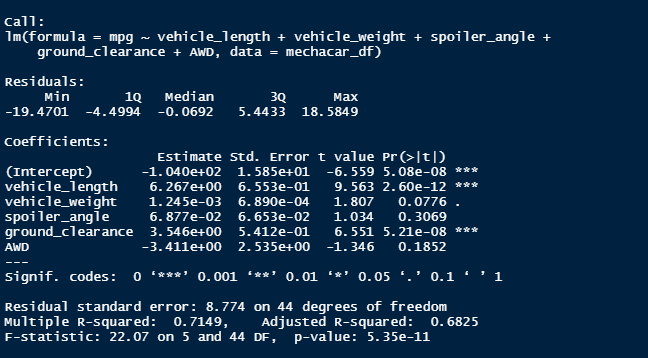

# MechaCar_Statistical_Analysis

## Linear Regression to Predict MPG

From the picture above looking at the `Pr(>|t|)` column, we can see that only vehicle length, and clearance provide a significant amount of varriance to the MPG of the car. Looking at the coefficients. Each Coeffecient in the top image indicates the slop of mpg corelating with that variable. For both vehicle_length and ground_clearance. the model will predict the mpg of a vehicle aproximatly 72% of the time and has a small p value. its decent at predicting mpg but not great at it. ideally the probability of a correct guess would be above 95%.

## Summary Statistics on Suspension Coils

Looking at these tables we can see that across all lots the PSI variance does not exceed the 100 value set by MechaCar. The only lot to fail this variance is lot 3 with a variance of 170.3.
